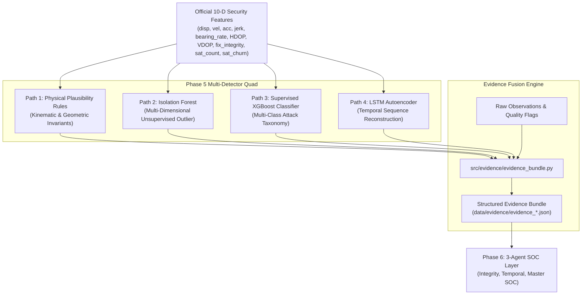

# LOCUS Phase 5 — Multi-Detector Architecture & Evidence Fusion

**Document Version**: 1.0  
**Phase**: LOCUS Phase 5 (Detection & Machine Learning Engines)  
**Status**: Verified & Operational  
**Feature Input**: Official 10-D Security Feature Vector ([`data/features/locus_security_features.csv`](file:///c:/Users/New/Downloads/Logs/Logs/Task/locus_project/data/features/locus_security_features.csv))  
**Evidence Artifacts**: [`data/evidence/`](file:///c:/Users/New/Downloads/Logs/Logs/Task/locus_project/data/evidence/)  

---

## 1. Executive Summary

Phase 5 implements the multi-detector layer of the LOCUS GNSS cybersecurity framework. Rather than relying on a single brittle classifier or monolithic heuristic, LOCUS combines **four complementary detection paths** spanning physics, statistics, supervised machine learning, and deep temporal modeling.

Crucially, **Phase 5 does not make the final SOC verdict**. Its mission is to produce rich, objective, and immutable **Evidence Bundles** containing raw observations, kinematic evaluations, statistical anomaly scores, and reconstruction error spectra for subsequent interpretation by Phase 6 (AI SOC Agents).



---

## 2. Detector Path 1: Physical Plausibility Rules Engine

- **Module**: [`src/detection/physical_rules.py`](file:///c:/Users/New/Downloads/Logs/Logs/Task/locus_project/src/detection/physical_rules.py)
- **Class**: `PhysicalRulesEngine`
- **Configuration**: `PhysicalRulesConfig`

### 2.1 Scientific & Kinematic Principles
Physical rules operate as deterministic hard boundaries rooted in Newtonian physics and receiver electronics:
1. **Kinematic Acceleration Limit**: Terrestrial road vehicles are physically incapable of exceeding $10\text{ m/s}^2$ ($~1.0g$) sustained acceleration or braking without collision. Instantaneous acceleration jumps $> 10\text{ m/s}^2$ signify spoofed coordinate step injections.
2. **Jerk Invariants**: Jerk ($j = da/dt$) measures the rate of acceleration change. Mechanical drivetrains and suspension limit jerk below $15\text{ m/s}^3$. Discontinuous spoofer takeovers inject abrupt jerk spikes ($> 25\text{ m/s}^3$).
3. **Terrestrial Speed Cap**: Instantaneous velocity $> 85\text{ m/s}$ ($306\text{ km/h}$) indicates coordinate teleportation.
4. **Circular Angular Velocity**: Rapid bearing changes ($> 90^\circ/\text{s}$) occurring at non-zero ground speed ($> 2\text{ m/s}$) violate vehicle steering geometry.
5. **Geometric Dilution of Precision**: $\text{HDOP} > 8.0$ and $\text{VDOP} > 10.0$ flag acute geometric starvation or satellite masking.
6. **Mathematical Trilateration Minimum**: Fewer than 4 satellites renders 3D fix determination mathematically impossible; fewer than 6 satellites renders the receiver acutely vulnerable to single-satellite spoofing.

### 2.2 Output Severity Taxonomy
Every evaluated epoch produces a structured summary:
- `INFO`: Nominal operation within physical tolerances.
- `WARNING`: Approaching physical limits or degraded geometry.
- `HIGH`: Unlikely physical values indicating probable interference.
- `CRITICAL`: Physically impossible kinematics or acute fix compromise.

---

## 3. Detector Path 2: Isolation Forest Unsupervised Anomaly Detector

- **Module**: [`src/detection/isolation_forest.py`](file:///c:/Users/New/Downloads/Logs/Logs/Task/locus_project/src/detection/isolation_forest.py)
- **Model Artifact**: [`models/isolation_forest.joblib`](file:///c:/Users/New/Downloads/Logs/Logs/Task/locus_project/models/isolation_forest.joblib)
- **Diagnostic Distribution Plot**: [`docs/plots/isolation_forest_distribution.png`](file:///c:/Users/New/Downloads/Logs/Logs/Task/locus_project/docs/plots/isolation_forest_distribution.png)

### 3.1 Architecture & Preprocessing
- **Feature Vector**: All 10 dimensions of the official security vector.
- **Missing Value Handling**: Median imputer for `sat_churn` when historical PRN tracking was unrecorded, preventing artificial feature elimination.
- **Scaling**: `RobustScaler` (median-centered, interquartile range scaled) to ensure extreme spoofer outliers do not distort scaling parameters.
- **Parameters**: 200 estimators, $2\%$ baseline contamination rate, reproducible seed.

### 3.2 Normalized Anomaly Calibration
Raw Scikit-Learn `score_samples()` values are mapped onto a monotonic $[0.0, 1.0]$ anomaly score using a calibrated sigmoid function centered at the model decision boundary offset:
$$\text{anomaly\_score} = \frac{1}{1 + e^{-15 \cdot (\text{offset} - s_{\text{raw}})}}$$
Scores near $0.0$ represent typical inlier observations; scores $> 0.50$ flag statistically isolated feature combinations.

---

## 4. Detector Path 3: Supervised XGBoost Classifier Infrastructure

- **Module**: [`src/detection/xgboost_detector.py`](file:///c:/Users/New/Downloads/Logs/Logs/Task/locus_project/src/detection/xgboost_detector.py)
- **Classification Taxonomy**:
  - `0`: Benign Nominal GNSS
  - `1`: Trajectory Injection / Spoofing
  - `2`: Wideband RF Jamming / Starvation
  - `3`: Meaconing / Replay Takeover
  - `4`: Multipath / Urban Canyon Reflection

### 4.1 Strict Provenance Safeguard
In strict adherence to empirical cybersecurity integrity, **verified attack labels are never hallucinated or synthesized without verifiable provenance**.
- When operating on the real-world stationary baseline dataset, the detector honestly reports `status: UNFITTED_PENDING_LABELLED_SCENARIOS`.
- Full end-to-end training, cross-validation, feature importance tracking, and inference methods are fully implemented and verified via unit tests, standing ready for synthetic and scenario-based attack logs.

---

## 5. Detector Path 4: LSTM Temporal Sequence Anomaly Detector

- **Module**: [`src/detection/temporal_model.py`](file:///c:/Users/New/Downloads/Logs/Logs/Task/locus_project/src/detection/temporal_model.py)
- **Weights Artifact**: [`models/temporal_model.pt`](file:///c:/Users/New/Downloads/Logs/Logs/Task/locus_project/models/temporal_model.pt)
- **Metadata Artifact**: [`models/temporal_metadata.joblib`](file:///c:/Users/New/Downloads/Logs/Logs/Task/locus_project/models/temporal_metadata.joblib)

### 5.1 Architecture & Sequence Modeling
- **Model**: PyTorch LSTM Autoencoder.
  - Input: Sliding sequence window $W = 10\text{ epochs} \times 10\text{ features}$.
  - Encoder: 1-layer LSTM ($10 \rightarrow 32$ hidden units).
  - Latent Representation: 32-dimensional sequential context vector.
  - Decoder: 1-layer LSTM ($32 \rightarrow 32 \rightarrow 10$ linear output).
- **Session Boundary Preservation Guarantee**: Sliding windows **never span across session breaks**. Sessions with fewer than 10 epochs are safely skipped rather than concatenated.
- **Chronological Data Partitioning**: Preserves temporal arrow-of-time during training and validation, eliminating lookahead leakage.

### 5.2 Per-Feature Error Attribution
When a temporal sequence produces high reconstruction error ($\text{MSE} > \text{threshold}$), the model calculates per-feature mean squared errors across the window:
$$\text{MSE}_j = \frac{1}{W} \sum_{t=1}^W \left(x_{t, j} - \hat{x}_{t, j}\right)^2$$
This provides the downstream SOC agents with immediate root-cause attribution (e.g., whether temporal anomalousness originated from velocity discontinuities, C/N0 collapse, or sudden bearing swings).

---

## 6. Evidence Fusion Engine & Standardized Evidence Bundle

- **Module**: [`src/evidence/evidence_bundle.py`](file:///c:/Users/New/Downloads/Logs/Logs/Task/locus_project/src/evidence/evidence_bundle.py)
- **Class**: `EvidenceBundle` & `EvidenceFusionEngine`
- **Output Sample**: [`data/evidence/evidence_stream_sample.jsonl`](file:///c:/Users/New/Downloads/Logs/Logs/Task/locus_project/data/evidence/evidence_stream_sample.jsonl)

### 6.1 Evidence Bundle JSON Schema
Each generated evidence bundle contains:
```json
{
  "event_id": "evt_4_228",
  "timestamp_utc": "2026-09-28T07:15:38.000Z",
  "timestamp_pc": "2026-09-28T12:45:38.100+05:30",
  "session_id": 4,
  "epoch_id": 228,
  "location": {
    "latitude": 23.104312,
    "longitude": 72.592534,
    "altitude_m": 58.6
  },
  "security_features": {
    "disp_haversine": 0.082,
    "vel_kinematic": 0.082,
    "acc_kinematic": 0.012,
    "jerk_kinematic": 0.006,
    "bearing_rate": 0.0,
    "HDOP": 0.82,
    "VDOP": 1.15,
    "fix_integrity": 0.941,
    "sat_count_tot": 19,
    "sat_churn": null
  },
  "physical_rules": {
    "is_anomalous": false,
    "triggered_count": 0,
    "max_severity": "INFO",
    "triggered_rules": []
  },
  "isolation_forest": {
    "is_anomaly": false,
    "anomaly_score": 0.214,
    "raw_score": -0.382
  },
  "xgboost": {
    "available": false,
    "status": "UNFITTED_PENDING_LABELLED_SCENARIOS"
  },
  "temporal_model": {
    "status": "INFERRED",
    "is_anomaly": false,
    "reconstruction_error": 0.042,
    "temporal_anomaly_score": 0.187,
    "feature_errors": { ... }
  },
  "data_quality": {
    "fix_quality": 1,
    "satellites_used": 19,
    "satellites_in_view": 23,
    "hdop": 0.82,
    "avg_cno": 37.8,
    "data_quality_flag": "VALID"
  },
  "model_versions": {
    "physical_rules_version": "prules-v1.0",
    "isolation_forest_version": "iforest-v1.0",
    "xgboost_version": "xgboost-v1.0",
    "temporal_model_version": "lstm-temporal-v1.0"
  }
}
```

---

## 7. Verification & Test Coverage

All detection components and evidence pipelines are fully validated with zero failures:
- `tests/test_detection.py`: Validates physical thresholds, mathematical boundary checks, model loading, streaming inference buffers, and evidence bundle serialization.
- `tests/test_security_features.py`: Validates input feature correctness and invariance.
- `tests/test_processing.py`: Validates session isolation and quality preprocessing.
- `tests/test_parsing.py`: Validates NMEA and PRN parsing logic.

```
Total Test Suite: 31 Unit & Integration Tests -> 100% Passing
```
