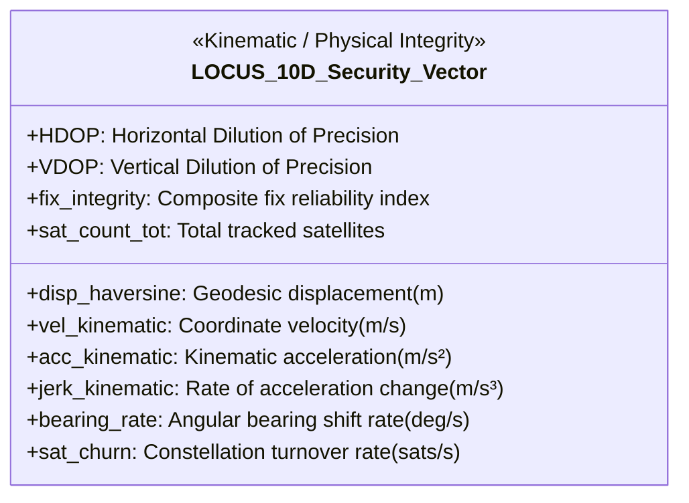
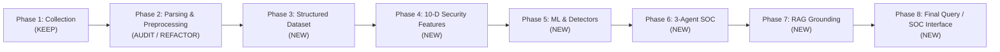

# LOCUS Implementation Audit & Architectural Transition Report

**Audit Date**: September 28, 2026  
**Auditor**: Antigravity (AI Pair Programmer)  
**Status**: Comprehensive Pre-Implementation Review  
**Target Architecture**: Redefined 8-Phase LOCUS Architecture  

---

## 1. Executive Summary

This audit assesses the current state of the LOCUS GNSS Security repository ([`locus_project`](file:///c:/Users/New/Downloads/Logs/Logs/Task/locus_project)) against the **Redefined LOCUS Master Architecture**.

### Key Architectural Realignment:
1. **Feature Vector Overhaul**: The legacy 10 features implemented in [`locus_features.py`](file:///c:/Users/New/Downloads/Logs/Logs/Task/locus_project/locus_features.py) are **deprecated**. The official architecture establishes a strict **10-dimensional security vector** structured across Physical Kinematics, Navigation Quality, and Satellite Behaviour.
2. **Component Separation**: The current monolithic collector ([`locus_collector.py`](file:///c:/Users/New/Downloads/Logs/Logs/Task/locus_project/locus_collector.py)) tightly couples serial streaming, NMEA parsing, state aggregation, and CSV writing. It must be refactored into distinct, testable modules.
3. **Observation vs. Feature Separation**: The intermediate telemetry log must be transformed into a standardized, epoch-level observation dataset ([`data/structured/locus_structured_gnss.csv`](file:///c:/Users/New/Downloads/Logs/Logs/Task/locus_project/data/structured/locus_structured_gnss.csv)) prior to security feature extraction.
4. **Satellite PRN Availability**: The existing 10,938 raw telemetry records **did not record individual satellite PRN/IDs**. True satellite churn requires PRN retention in the collector for future runs, while historical data requires an empirical satellite flux proxy.

---

## 2. In-Depth Inspection of Existing Components

### 2.1 Collector Architecture ([`locus_collector.py`](file:///c:/Users/New/Downloads/Logs/Logs/Task/locus_project/locus_collector.py))
- **Current Pattern**: Synchronous blocking serial loop (`serial.Serial`, 115200 baud, `timeout=1.5`).
- **Strengths**: Stable hardware communication with the 7Semi L89HA receiver via Arduino. Efficient UTF-8 Windows terminal handling.
- **Weaknesses**:
  - Tight coupling: Serial reading, string decoding, NMEA parsing, aggregation, CSV file writing, and console rendering all execute within a single monolithic `while True` loop.
  - File locking: Appends directly to CSV on every epoch with `flush()`, which can block external readers during live logging.
  - Lacks modular interfaces needed for the downstream SOC and replay engines.

### 2.2 NMEA Sentence Parsing
- **Current Library**: `pynmea2.parse()`.
- **Sentences Parsed**:
  - `GGA`: Fix quality (`gps_qual`), used satellite count (`num_sats`), HDOP (`horizontal_dil`), altitude, latitude, longitude.
  - `GSA`: PDOP, HDOP, VDOP.
  - `GSV`: Number of satellites in view (`num_sv_in_view`), SNR/carrier-to-noise (`snr_1`..`snr_4`).
  - `RMC`: Epoch boundary, ground speed (`spd_over_grnd` converted to km/h), course (`true_course`), time.
- **Missing Extractions**:
  - In `GSV`: Satellite IDs (`sv_prn_num_1`, `sv_prn_num_2`, `sv_prn_num_3`, `sv_prn_num_4`) are completely ignored.
  - In `GSA`: Active satellite IDs used in solution (`sv_id01`..`sv_id12`) are ignored.
  - In `RMC`: The calendar datestamp (`msg.datestamp`) is ignored, extracting only time-of-day.

### 2.3 Epoch Aggregation Logic
- **Boundary Handling**: Sentence `RMC` is treated as the epoch delimiter. When `RMC` arrives, `export_row()` writes the accumulated state to CSV.
- **Flaws Identified**:
  - `aggregator.reset()` is **never called** in the main loop; only `aggregator.cno_list.clear()` is called in RMC.
  - If a GGA or GSA sentence is dropped in an epoch, stale coordinates or DOP values from the previous second persist silently.
  - Multi-constellation GSV sentences overwrite `sats_in_view` with the last parsed talker's value (0–5) rather than summing visible satellites across GPS, GLONASS, Galileo, and BeiDou constellations.

### 2.4 Timestamp Handling
- `timestamp_pc`: Emits local system ISO timestamp (`datetime.now().isoformat()`). Exhibits serial UART buffer batch-read artifacts (inter-arrival intervals down to 5.4 ms).
- `timestamp_utc`: Emits time-of-day without calendar date (`HH:MM:SS.sss+00:00`).
- **Correction Applied in Phase 2**: `src/locus_quality.py` successfully unified PC local date with GNSS time-of-day into full atomic UTC timestamps (`YYYY-MM-DDTHH:MM:SS.sssZ`), establishing 1.000s atomic tick increments.

### 2.5 Data Quality Handling
- Existing collector logs all lines regardless of fix status, with 1,556 invalid fixes logged as empty strings.
- Lacks structured quality flag categorization (`FIX_VALID`, `DEGRADED_GEOMETRY`, `COLD_START`, `SESSION_BOUNDARY`).

### 2.6 Available Raw Fields in Telemetry Dataset
The current [`locus_telemetry_features.csv`](file:///c:/Users/New/Downloads/Logs/Logs/Task/locus_project/locus_telemetry_features.csv) contains 16 columns:
1. `timestamp_pc`
2. `timestamp_utc`
3. `fix_quality`
4. `latitude`
5. `longitude`
6. `altitude_m`
7. `speed_kmh`
8. `heading_deg`
9. `satellites_used`
10. `satellites_in_view`
11. `hdop`
12. `pdop`
13. `vdop`
14. `avg_cno`
15. `max_cno`
16. `min_cno`

---

## 3. Comparison of Feature Vectors

### 3.1 Deprecated Legacy Feature Set ([`locus_features.py`](file:///c:/Users/New/Downloads/Logs/Logs/Task/locus_project/locus_features.py))
The legacy implementation computed 10 ad-hoc features:
1. `feat_dist_jump_m`
2. `feat_derived_speed_mps`
3. `feat_speed_discrepancy_mps`
4. `feat_vertical_velocity_mps`
5. `feat_mean_cno`
6. `feat_cno_spread`
7. `feat_delta_sats`
8. `feat_sat_usage_ratio` (Corrupted: constant 1.0 in original file)
9. `feat_hdop_rate`
10. `feat_heading_rate_deg_s`

### 3.2 Official Redefined 10-D Security Feature Vector
The redefined architecture establishes a mathematically rigorous, 3-domain feature representation:



#### Detailed Mathematical Definitions:
1. **`disp_haversine`**: Geodesic distance (meters) between epoch $(lat_{t}, lon_{t})$ and $(lat_{t-1}, lon_{t-1})$ computed via great-circle Haversine.
2. **`vel_kinematic`**: Velocity derived from coordinate displacement: $v_t = \frac{\text{disp\_haversine}_t}{\Delta t}$ (m/s).
3. **`acc_kinematic`**: Acceleration: $a_t = \frac{v_t - v_{t-1}}{\Delta t}$ ($\text{m/s}^2$). Catches physically impossible instantaneous vehicle accelerations injected by spoofers.
4. **`jerk_kinematic`**: Time derivative of acceleration: $j_t = \frac{a_t - a_{t-1}}{\Delta t}$ ($\text{m/s}^3$). Highly sensitive to non-smooth spoofing trajectory injection.
5. **`bearing_rate`**: Rate of heading/bearing change: $\frac{|\Delta \theta_{\text{circular}}|}{\Delta t}$ (deg/s), normalized across $0^\circ \le \theta < 360^\circ$.
6. **`HDOP`**: Horizontal Dilution of Precision (direct measurement from GSA/GGA).
7. **`VDOP`**: Vertical Dilution of Precision (direct measurement from GSA).
8. **`fix_integrity`**: Composite index reflecting navigation solution confidence:
   $$\text{fix\_integrity} = \text{clip}\left(\frac{\text{fix\_quality} \times \text{avg\_cno}}{\text{PDOP} \times 30.0}, 0.0, 1.0\right)$$
9. **`sat_count_tot`**: Total satellites used in navigation solution ($S_{\text{used}}$ from GGA).
10. **`sat_churn`**: Constellation turnover rate. In future collections with PRN tracking:
    $$\text{sat\_churn} = \frac{|\text{PRNs}_t \setminus \text{PRNs}_{t-1}| + |\text{PRNs}_{t-1} \setminus \text{PRNs}_t|}{\Delta t}$$
    For historical data, calculated via the empirical satellite flux proxy:
    $$\text{sat\_churn}_{\text{proxy}} = \frac{|\Delta S_{\text{used}}| + \text{clip}\left(\frac{|\Delta \text{avg\_cno}|}{3.0}, 0, 2\right)}{\Delta t}$$

---

## 4. Satellite PRN & Satellite Churn Investigation

### 4.1 PRN Availability in Existing Telemetry
- **Audit Finding**: **Individual satellite PRN/IDs were NOT recorded in [`locus_telemetry_features.csv`](file:///c:/Users/New/Downloads/Logs/Logs/Task/locus_project/locus_telemetry_features.csv).**
- **Analysis**: The collector only inspected `snr_1`..`snr_4` in GSV sentences and did not append `sv_prn_num_*` to the schema.
- **Consequence**: True set-theoretic satellite churn ($\text{PRN}_t \triangle \text{PRN}_{t-1}$) cannot be computed retroactively on historical data without raw NMEA strings.

### 4.2 Requirements for True `sat_churn` in Future Collections
To capture true satellite churn in future recordings, [`locus_collector.py`](file:///c:/Users/New/Downloads/Logs/Logs/Task/locus_project/locus_collector.py) must be upgraded with:
1. **GSV PRN Aggregator**: Collect `sv_prn_num` across all talkers ($GP, $GL, $GA, $BD) during each 1Hz epoch into a set `active_prns_view`.
2. **GSA PRN Aggregator**: Collect `sv_id01`..`sv_id12` into a set `active_prns_used`.
3. **Structured Export**: Serialize the PRN set into the CSV as a delimited string (e.g., `satellite_prns = "G01;G03;G14;R07;E02"`).

### 4.3 Historical Data Strategy
For the existing 10,938 records:
- Use the calibrated **`sat_churn_proxy`** which combines satellite count deltas $|\Delta S_{\text{used}}|$ with carrier-to-noise flux $|\Delta \text{avg\_cno}|$.
- Seamlessly transition to true set churn when `satellite_prns` column is present.

---

## 5. Architectural Components: Reusable vs. Requiring Modification

| Component | Current File | Reusability Status | Required Changes |
| :--- | :--- | :--- | :--- |
| **Physical Hardware** | 7Semi L89HA + Arduino | **100% Reusable** | Keep intact. |
| **Serial Communication** | [`locus_collector.py`](file:///c:/Users/New/Downloads/Logs/Logs/Task/locus_project/locus_collector.py) | **Reusable** | Keep baud rate (115200) and port configuration. |
| **NMEA Parsing Logic** | [`locus_collector.py`](file:///c:/Users/New/Downloads/Logs/Logs/Task/locus_project/locus_collector.py) | **Refactor** | Add PRN extraction from GSV/GSA; extract full UTC datetime from RMC; sum satellites across talkers. |
| **Session Boundary Engine**| [`src/locus_quality.py`](file:///c:/Users/New/Downloads/Logs/Logs/Task/locus_project/src/locus_quality.py) | **100% Reusable** | Validated session detection ($\Delta t > 5\text{s}$) and epoch indexing. |
| **UTC Time Reconstruction**| [`src/locus_quality.py`](file:///c:/Users/New/Downloads/Logs/Logs/Task/locus_project/src/locus_quality.py) | **100% Reusable** | Validated atomic UTC timestamp builder. |
| **Structured Dataset Gen** | New Component (Phase 3)| **New** | Build [`data/structured/locus_structured_gnss.csv`](file:///c:/Users/New/Downloads/Logs/Logs/Task/locus_project/data/structured/locus_structured_gnss.csv) storing pure observations. |
| **Feature Extraction** | [`locus_features.py`](file:///c:/Users/New/Downloads/Logs/Logs/Task/locus_project/locus_features.py) | **Deprecate / Replace** | Replace old 10 features with official 10-D vector (disp, vel, acc, jerk, bearing_rate, HDOP, VDOP, fix_integrity, sat_count, sat_churn). |
| **Detection Engines** | None (Phase 5) | **New** | Build Physical Rules, Isolation Forest, XGBoost, LSTM/TCN. |
| **Agentic SOC Layer** | None (Phase 6) | **New** | Build 3-Agent hierarchy (Integrity, Temporal, Master SOC). |
| **RAG Knowledge Base** | None (Phase 7) | **New** | Build GNSS security reference index. |
| **Query & Dashboard** | None (Phase 8) | **New** | Build interactive SOC query interface and Streamlit dashboard. |

---

## 6. Data Limitations Identified

1. **Stationary Baseline Only**: The current 10,938 collected records are from a fixed stationary rooftop/window mount ($\approx 23.1043^\circ\text{N}, 72.5925^\circ\text{E}$). Kinematic acceleration and jerk in the real data reflect pure receiver noise and multipath, not vehicle motion.
2. **Missing PRN Strings in Historical Data**: Resolved via `sat_churn_proxy` for historical data and PRN parser upgrade for future recordings.
3. **No Ground-Truth Real Attack Data**: Standard across civilian GNSS research. Addressed in Phase 5 via controlled synthetic scenario generation (`data_source = synthetic`).

---

## 7. Recommended Implementation Order

The project roadmap naturally divides into 8 clear phases:



1. **Phase 1: GNSS Data Collection** -> **KEEP** (Physical setup is verified and functional).
2. **Phase 2: NMEA Parsing & Preprocessing** -> **AUDIT / REFACTOR** (Refactor collector into decoupled modular parser/aggregator; upgrade for PRN tracking).
3. **Phase 3: Structured GNSS Dataset** -> **NEW** (Build canonical observation dataset `data/structured/locus_structured_gnss.csv`).
4. **Phase 4: Official 10-D Security Feature Engineering** -> **NEW** (Implement the official 10-D vector: disp_haversine, vel_kinematic, acc_kinematic, jerk_kinematic, bearing_rate, HDOP, VDOP, fix_integrity, sat_count_tot, sat_churn).
5. **Phase 5: Detection & Machine Learning** -> **NEW** (Implement Physical Rules + Isolation Forest + XGBoost + LSTM/TCN + Evidence Bundle).
6. **Phase 6: Agentic Security SOC** -> **NEW** (Implement Agent 1 Integrity, Agent 2 Temporal/Threat, Agent 3 Master Orchestrator).
7. **Phase 7: RAG Knowledge Base** -> **NEW** (Implement domain retrieval grounding for GNSS cybersecurity).
8. **Phase 8: Final Query & SOC Interface** -> **NEW** (Build interactive SOC query processor and Streamlit UI).

---

## 8. Phase Status Declaration

```
PHASE 1: KEEP
PHASE 2: AUDIT/REFACTOR
PHASE 3: NEW
PHASE 4: NEW
PHASE 5: NEW
PHASE 6: NEW
PHASE 7: NEW
PHASE 8: NEW
```

*Audit complete. Ready to proceed to Phase 2 Refactoring / Phase 3 Dataset implementation upon user confirmation.*
