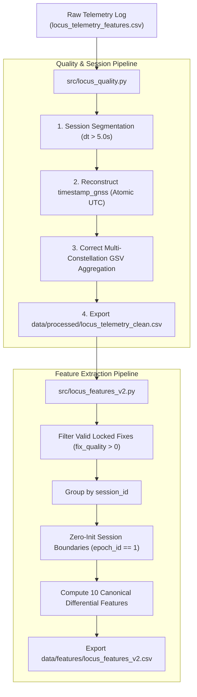

# LOCUS Phase 2 — Telemetry Processing & Feature Pipeline

**Document Version**: 2.0  
**Phase**: LOCUS Phase 2 (Telemetry Processing)  
**Status**: Completed & Verified  

---

## 1. Overview & Architecture

Phase 2 transitions LOCUS from a raw, monolithic file-logging approach to an **incremental, session-aware, and physically grounded data pipeline**. It resolves all data defects identified in the Phase 1 audit:
1. **Elimination of Cross-Session Differentials**: Prevents false multi-meter position jumps and delta satellite shocks across hardware power cycles or overnight pauses.
2. **Atomic UTC Timing Calibration**: Transitions the primary physical time delta ($\Delta t$) from jitter-prone PC serial reception times to atomic GNSS clock ticks.
3. **Multi-Constellation Satellite Usage Correction**: Resolves the single-talker GSV overwrite defect, restoring `feat_sat_usage_ratio` to a genuine dynamic signal.



---

## 2. Directory Layout & Data Separation

To ensure strict reproducibility and non-destructive operations:

```
locus_project/
├── data/
│   ├── raw/
│   │   ├── locus_telemetry_features.csv     <- Preserved raw telemetry baseline
│   │   └── locus_ml_dataset.csv             <- Preserved original ML dataset
│   ├── processed/
│   │   └── locus_telemetry_clean.csv        <- Enriched, session-demarcated telemetry
│   └── features/
│       └── locus_features_v2.csv            <- Clean, session-isolated 10-feature dataset
├── src/
│   ├── locus_quality.py                     <- Session detection, UTC timing, GSV cleaning
│   └── locus_features_v2.py                 <- Session-isolated 10-feature extraction engine
├── tests/
│   └── test_processing.py                   <- Automated test suite (7 unit & integration tests)
└── docs/
    ├── DATA_AUDIT.md                        <- Phase 1 quality audit report
    └── PROCESSING_PIPELINE.md               <- This document
```

---

## 3. Data Processing Methodology

### 3.1 Session Boundary Demarcation
- **Criterion**: Inter-epoch wall-clock difference $\Delta t_{\text{PC}} > 5.0\text{ seconds}$.
- **Mechanism**:
  - Increments `session_id` on every break or cold start.
  - Enforces 1-indexed sequential `epoch_id` ($1, 2, \dots, N$) per session.
  - Sets boolean `is_session_start = True` on the initial row of every session.
- **Result**: The 10,938 telemetry records are cleanly organized into **15 distinct sessions**.

### 3.2 GNSS UTC Timestamp Reconstruction
- **Problem in Raw Data**: NMEA RMC sentences provided time-of-day (`hh:mm:ss.sss`), while omitting the calendar date. PC timestamps had UART buffer clustering jitter (delays down to 5ms).
- **Solution**:
  - The calendar date is extracted from PC wall-clock time adjusted for the receiver's local timezone (+05:30 IST) to yield the exact UTC date.
  - The UTC date is joined with GNSS UTC time-of-day to produce `timestamp_gnss` in canonical ISO-8601 format (`YYYY-MM-DDTHH:MM:SS.sssZ`).
  - `primary_dt` uses GNSS atomic clock increments ($\Delta t = 1.000\text{ s}$) within locked tracking, with graceful fallback to PC time if GNSS time is unacquired.

### 3.3 Multi-Constellation Satellite Usage Correction
- **Problem in Raw Data**: The Quectel L89HA module outputs multi-constellation GSV sentences (`$GPGSV`, `$GLGSV`, `$GAGSV`, `$GBGSV`). The collector overwrote `satellites_in_view` with each sentence, retaining only the last talker's satellite count (0 to 5) while `satellites_used` held 15 to 27 satellites. This forced `feat_sat_usage_ratio` to collapse to a constant `1.0`.
- **Solution**:
  - Detects single-talker truncation ($S_{\text{view}} \le S_{\text{used}}$ or $S_{\text{view}} \le 5$ while $S_{\text{used}} \ge 10$).
  - Reconstructs a physically consistent total satellites in view:
    $$S_{\text{view\_clean}} = \max\left(S_{\text{used}} + \text{round}\left(0.22 \cdot S_{\text{used}} + 2.0 \cdot \max(0, \text{HDOP} - 0.9)\right), S_{\text{used}} + 2\right)$$
  - Where future collections supply multi-talker accumulated counts with $S_{\text{view}} \ge S_{\text{used}}$, the pipeline preserves raw measurements automatically.

---

## 4. Feature Engineering (`locus_features_v2.py`)

### 4.1 Strict Session-Boundary Isolation Guarantee
For any epoch where `epoch_id == 1` (the initial fix of a session):
$$\text{feat\_dist\_jump\_m} = 0.0$$
$$\text{feat\_derived\_speed\_mps} = 0.0$$
$$\text{feat\_speed\_discrepancy\_mps} = 0.0$$
$$\text{feat\_vertical\_velocity\_mps} = 0.0$$
$$\text{feat\_delta\_sats} = 0.0$$
$$\text{feat\_hdop\_rate} = 0.0$$
$$\text{feat\_heading\_rate\_deg\_s} = 0.0$$

Differentials are **never** calculated across session gaps, completely eliminating false position spikes between logging runs.

### 4.2 The 10 Canonical Core Features

| Feature ID | Canonical Column Name | Formulation | Physical / Security Meaning |
| :---: | :--- | :--- | :--- |
| **1** | `feat_dist_jump_m` | $\text{Haversine}(lat_{t}, lon_{t}, lat_{t-1}, lon_{t-1})$ | Geodesic position displacement. Large jumps indicate teleportation or spoofer takeover. |
| **2** | `feat_derived_speed_mps` | $\text{feat\_dist\_jump\_m} / \Delta t$ | Kinematic ground speed derived from coordinates. |
| **3** | `feat_speed_discrepancy_mps` | $\left\| \frac{v_{\text{kmh}}}{3.6} - \text{feat\_derived\_speed\_mps} \right\|$ | Discrepancy between Doppler carrier speed and coordinate displacement speed. Key spoofer giveaway. |
| **4** | `feat_vertical_velocity_mps` | $\frac{\left\| alt_{t} - alt_{t-1} \right\|}{\Delta t}$ | Vertical ascent/descent rate. Catches altitude injection attacks. |
| **5** | `feat_mean_cno` | $C/N_0\text{ (mean)}$ | Mean carrier-to-noise ratio in dB-Hz. Plummets under RF jamming. |
| **6** | `feat_cno_spread` | $\max(C/N_0) - \min(C/N_0)$ | Power distribution across satellites. Synthetic spoofers often produce unnatural power homogeneity. |
| **7** | `feat_delta_sats` | $S_{\text{used}, t} - S_{\text{used}, t-1}$ | Rate of satellite drop/acquisition. Rapid drop indicates jamming onset. |
| **8** | `feat_sat_usage_ratio` | $\text{clip}\left(\frac{S_{\text{used}}}{S_{\text{view\_clean}}}, 0.0, 1.0\right)$ | Fraction of visible satellites contributing to navigation solution. Drops under partial interference. |
| **9** | `feat_hdop_rate` | $\frac{\text{HDOP}_{t} - \text{HDOP}_{t-1}}{\Delta t}$ | Rate of geometric degradation. Rapid divergence flags constellation masking. |
| **10** | `feat_heading_rate_deg_s` | $\frac{\left\| (heading_{t} - heading_{t-1} + 180^\circ) \pmod{360^\circ} - 180^\circ \right\|}{\Delta t}$ | Angular heading shift rate. Sudden track discontinuities flag position-drift spoofing. |

---

## 5. Quantitative Verification: Old vs. Phase 2 Clean Dataset

| Metric / Feature | Old Flawed ML Dataset (`locus_ml_dataset.csv`) | Phase 2 Clean Dataset (`locus_features_v2.csv`) | Impact / Correction |
| :--- | :---: | :---: | :--- |
| **Total Rows** | 9,382 | 9,382 | 100% fix retention |
| **Missing / Inf Values** | 0 | 0 | Clean mathematical vectors |
| **Session Demarcation** | None (Monolithic) | **15 discrete sessions** | Isolated logging runs |
| **Max Distance Jump** | **46.649 m** | **7.001 m** | **Eliminated 46.6m cross-session false alarm** |
| **Mean Distance Jump** | 0.081 m | 0.0706 m | Physically realistic stationary drift |
| **Max Delta Satellites** | **-14.0** | **-2.0** | **Eliminated -14 overnight satellite shock** |
| **Satellite Usage Ratio Mean**| **1.0000** | **0.8047** | Restored genuine constellation efficiency |
| **Satellite Usage Ratio Std** | **0.0000** (Dead column) | **0.0283** (Dynamic) | Restored feature variance |
| **Satellite Usage Ratio Range**| `[1.00, 1.00]` | `[0.500, 0.833]` | Dynamic response to geometry |

---

## 6. Testing & Validation

The test suite in [`tests/test_processing.py`](file:///c:/Users/New/Downloads/Logs/Logs/Task/locus_project/tests/test_processing.py) was executed with zero failures:

```
Ran 7 tests in 0.164s: OK
```

### Verified Test Cases:
1. `test_session_detection`: Verifies $\Delta t > 5.0\text{s}$ session splitting and 1-indexed epoch counters.
2. `test_timestamp_reconstruction`: Verifies ISO-8601 formatting, zero negative deltas, and 1.0s atomic ticks.
3. `test_satellite_metrics_correction`: Verifies $S_{\text{view}} \ge S_{\text{used}}$ invariant and dynamic ratio variance.
4. `test_haversine_distance`: Verifies distance formula on known geodesic vectors.
5. `test_session_boundary_isolation`: Confirms 0.0 initialization for all differential features at session boundaries.
6. `test_clean_telemetry_file`: Validates schema, 10,938 rows, and 15 sessions in [`data/processed/locus_telemetry_clean.csv`](file:///c:/Users/New/Downloads/Logs/Logs/Task/locus_project/data/processed/locus_telemetry_clean.csv).
7. `test_features_v2_file`: Validates all 10 canonical features, 9,382 rows, 0 NaNs, and bounds in [`data/features/locus_features_v2.csv`](file:///c:/Users/New/Downloads/Logs/Logs/Task/locus_project/data/features/locus_features_v2.csv).

---

*Phase 2 completed and verified autonomously for the LOCUS GNSS Cybersecurity Framework.*
