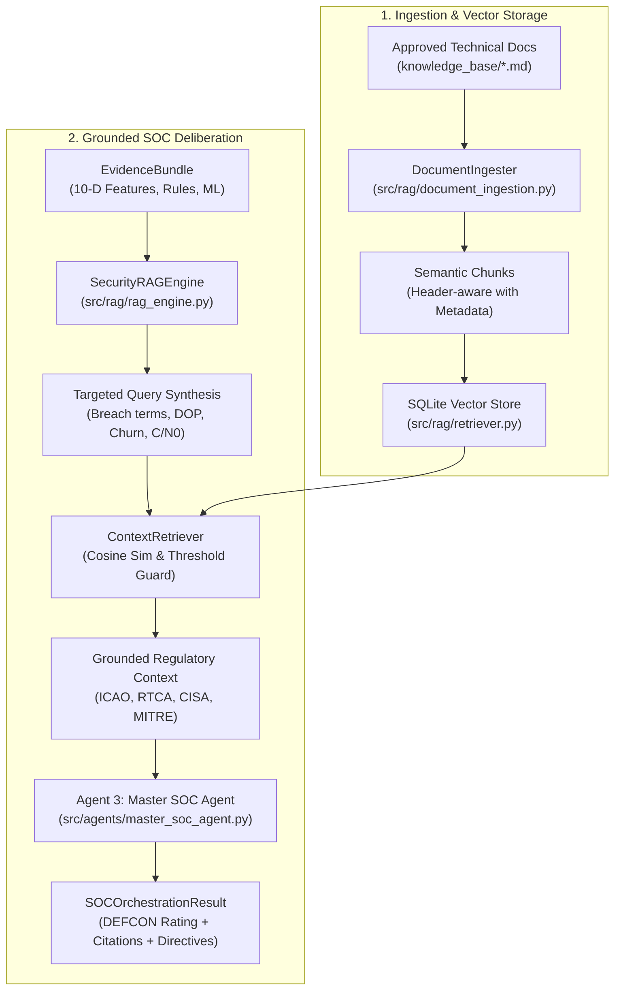

# LOCUS Security RAG Subsystem Architecture

**System Component**: Security Retrieval-Augmented Generation (RAG)  
**Modules**: `src/rag/document_ingestion.py`, `src/rag/retriever.py`, `src/rag/rag_engine.py`  
**Knowledge Base Directory**: `knowledge_base/`  
**Vector Store**: `data/rag/vector_store.db` (Local SQLite Vector Store)  
**Primary Integration**: Agent 3 (Master SOC Agent / Orchestrator)  
**Status**: Verified & Operational (72 tests passing)  

---

## 1. Executive Summary & Architectural Role

The **LOCUS Security RAG Subsystem** provides deterministic technical grounding, regulatory compliance citations, and actionable mitigation guidance for GNSS cyber-physical anomalies. 

### Critical Invariants:
1. **Contextual Grounding Only**: The RAG subsystem explains and attributes incidents using approved international standards. It is **NOT** the source of actual sensor measurements.
2. **Strict Telemetry Immutability**: The RAG layer operates strictly read-only and **never** mutates, interpolates, or fabricates raw sensor numbers or feature vectors.
3. **No Hallucinations / Unsupported Claims**: Every emitted technical statement or containment action must be linked directly to an indexed authority.
4. **Explicit Insufficient Knowledge Fallback**: If a query or evidence profile does not meet the minimum semantic relevance threshold ($\text{similarity} < 0.12$), the engine explicitly indicates:
   > `"Insufficient knowledge context retrieved for query. No supported regulatory citations found."`



---

## 2. Approved Knowledge Base Inventory (`knowledge_base/`)

The knowledge base contains 8 curated, authoritative technical documents structured with domain tags and formal regulatory standards:

| Document | Primary Domain | Standard Authorities | Key Technical Content |
| :--- | :--- | :--- | :--- |
| [`gnss_fundamentals.md`](file:///d:/LOCUS/LOCUS-main/knowledge_base/gnss_fundamentals.md) | Signal Structure & PVT | ICAO Annex 10 Vol I, IS-GPS-200 | Constellation frequencies (L1, L2, L5), pseudo-range equations, carrier-phase, Doppler velocity derivation. |
| [`gnss_integrity_raim.md`](file:///d:/LOCUS/LOCUS-main/knowledge_base/gnss_integrity_raim.md) | RAIM & Integrity Monitoring | RTCA DO-229E, FAA AC 20-138D | Horizontal/Vertical Protection Levels (HPL/VPL), Alert Limits, parity space, Fault Detection & Exclusion (FDE). |
| [`gnss_spoofing.md`](file:///d:/LOCUS/LOCUS-main/knowledge_base/gnss_spoofing.md) | False Signal Injection | CISA Resilient PNT, ICAO Doc 9849 | Simplistic vs lift-off spoofing, meaconing, Doppler-velocity discrepancy, kinematic teleportation, CRPA nulling. |
| [`gnss_jamming_rfi.md`](file:///d:/LOCUS/LOCUS-main/knowledge_base/gnss_jamming_rfi.md) | Radio Frequency Interference | ITU Radio Regs, RTCA DO-235B | Signal power attenuation, carrier-to-noise floor ($C/N_0 < 25\text{ dB-Hz}$), constellation starvation, loss of lock. |
| [`navigation_quality_dop.md`](file:///d:/LOCUS/LOCUS-main/knowledge_base/navigation_quality_dop.md) | Dilution of Precision | RTCA DO-229E, NMEA-0183 | Covariance matrix $Q = (G^T G)^{-1}$, HDOP/VDOP/PDOP mathematical formulations and operational tiers ($< 2.0$ to $> 8.0$). |
| [`satellite_behaviour_churn.md`](file:///d:/LOCUS/LOCUS-main/knowledge_base/satellite_behaviour_churn.md) | Orbital & Constellation Dynamics | IS-GPS-200, Galileo OS SIS ICD | MEO orbital traversal times, set-theoretic Jaccard churn ($\text{sat\_churn}$), physical turnover limits ($< 0.1\text{ sats/s}$). |
| [`anomaly_detection_principles.md`](file:///d:/LOCUS/LOCUS-main/knowledge_base/anomaly_detection_principles.md) | Multi-Detector Cyber-Physical ML | RTCA DO-229E, IEEE Aerospace | Newtonian limits ($a \le 10\text{ m/s}^2, j \le 25\text{ m/s}^3$), Isolation Forest spatial density, LSTM reconstruction errors. |
| [`security_concepts_mitre.md`](file:///d:/LOCUS/LOCUS-main/knowledge_base/security_concepts_mitre.md) | Threat Attribution & DEFCON | MITRE ATT&CK for Space, CISA PNT | T0803 (Spoofing), T0858 (Jamming), 5-tier DEFCON readiness escalation matrix, failover containment workflows. |

---

## 3. Subsystem Implementation Architecture

### 3.1 Document Ingestion (`src/rag/document_ingestion.py`)
- **Class**: `DocumentIngester`
- **Metadata Extraction**: Scans document headers to extract document title, standard authorities, and domain tags.
- **Section-Aware Chunking**:
  - Segments documents along markdown header boundaries (`## Section`, `### Subsection`).
  - Implements configurable chunk size (`max_chunk_size = 800` chars) and overlap (`overlap_size = 150` chars) for large narrative blocks.
  - Automatically prepends document title and section breadcrumbs to each chunk to preserve semantic context.

### 3.2 Vector Database & Retrieval (`src/rag/retriever.py`)
- **Class**: `VectorStore`
  - Backed by persistent local SQLite database (`data/rag/vector_store.db`).
  - Table `chunks`: stores `chunk_id`, `doc_name`, `title`, `section_title`, `text`, `authorities_json`, `tags_json`, and binary vector embedding blob (`embedding_blob`).
  - Fits a sublinear-scaled TF-IDF vectorizer across unigram, bigram, and trigram tokens ($[1, 3]$ n-grams, $L_2$ normalized).
- **Class**: `ContextRetriever`
  - Projects incoming query into embedding space and computes cosine similarity against all stored chunks.
  - Filters by minimum similarity threshold ($\tau = 0.12$).
  - Aggregates unique standard authorities from retrieved contexts.
  - If no chunk satisfies $\tau$, returns `has_sufficient_context = False` with a structured explanatory message.

### 3.3 Master RAG Engine (`src/rag/rag_engine.py`)
- **Class**: `SecurityRAGEngine`
  - Orchestrates the full lifecycle: document ingestion, vector database indexing, query execution, and SOC evidence grounding.
  - **Automated Evidence Query Synthesis (`ground_soc_evidence`)**:
    - Translates raw evidence metrics into targeted technical search terms:
      - Physical rule breaches: e.g., `"RULE_MAX_ACCELERATION acc 12.5 m/s2 exceeds max physical limit"`.
      - High kinematic velocity/jerk: e.g., `"GNSS spoofing kinematic teleportation acceleration jerk breach lift-off"`.
      - Poor geometry: e.g., `"navigation quality HDOP geometric degradation dilution of precision"`.
      - Weak signal / starvation: e.g., `"GNSS jamming radio frequency interference RFI C/N0 signal attenuation"`.
      - Excessive constellation turnover: e.g., `"satellite churn constellation turnover rate spoofer handover"`.
    - Returns structured grounding containing regulatory standards, cited sections, and mitigation recommendations.
  - **Agent 3 Deliberation (`deliberate_with_agent3`)**:
    - Dispatches grounded context directly into `MasterSOCAgent.deliberate()`, populating `agent_findings["rag_context"]` and appending regulatory citations to the executive summary.

---

## 4. Verification & Validation

The RAG subsystem is validated through an automated test suite ([`tests/test_rag.py`](file:///d:/LOCUS/LOCUS-main/tests/test_rag.py)) covering 9 unit and integration scenarios:
1. `test_ingest_knowledge_base_directory`: Verifies all 8 knowledge base documents are ingested and parsed.
2. `test_chunk_metadata_and_authorities`: Validates extraction of standard authorities (RTCA, ICAO, CISA) and tags.
3. `test_vector_store_indexing`: Confirms vector database population and persistent storage.
4. `test_semantic_retrieval_spoofing`: Validates retrieval accuracy for false signal injection and velocity discrepancies.
5. `test_semantic_retrieval_jamming`: Validates retrieval accuracy for carrier-to-noise attenuation and RFI.
6. `test_insufficient_context_fallback`: Confirms explicit `has_sufficient_context = False` for out-of-domain queries.
7. `test_rag_engine_query`: Tests end-to-end plain text query interface.
8. `test_ground_soc_evidence_non_mutation`: Verifies that grounding an Evidence Bundle never mutates underlying sensor values.
9. `test_agent3_integration`: Verifies Agent 3 deliberation receives grounded regulatory context and produces compliant DEFCON reports.

**Total Test Results Across LOCUS**:
```
pytest tests/ -v
============================= 72 passed in 7.66s ==============================
```
