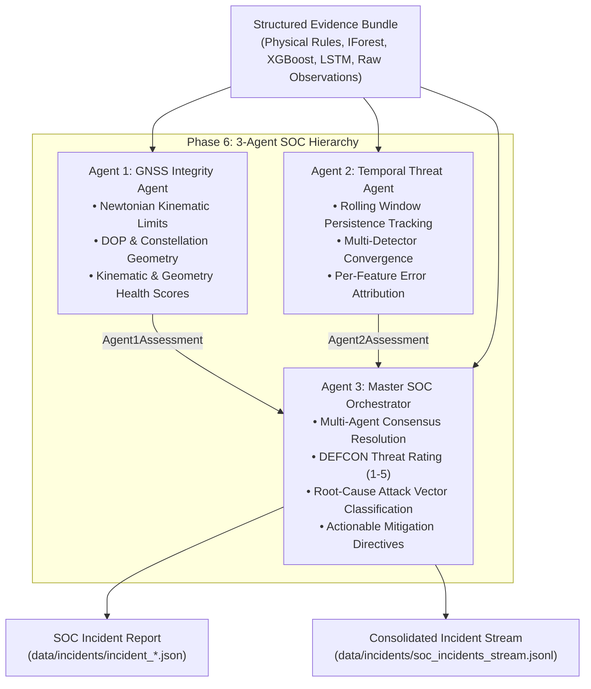

# LOCUS Phase 6 — 3-Agent Agentic Security SOC Architecture

**Document Version**: 1.0  
**Phase**: LOCUS Phase 6 (3-Agent Security SOC)  
**Status**: Verified & Operational  
**Evidence Input**: Standardized Evidence Bundles ([`data/evidence/`](file:///c:/Users/New/Downloads/Logs/Logs/Task/locus_project/data/evidence/))  
**Incident Artifacts**: [`data/incidents/`](file:///c:/Users/New/Downloads/Logs/Logs/Task/locus_project/data/incidents/)  

---

## 1. Executive Summary

Phase 6 implements the **autonomous 3-tier Security Operations Center (SOC) agent hierarchy** for the LOCUS GNSS cybersecurity framework. Rather than presenting raw detector alerts or uncoordinated alarms to human operators, LOCUS employs three specialized AI agents that deliberate over the multi-detector Evidence Bundles:

1. **Agent 1 (GNSS Integrity Agent)**: Evaluates single-epoch physical plausibility, kinematic invariants, and receiver geometry.
2. **Agent 2 (Temporal Threat Correlation Agent)**: Evaluates multi-epoch sequence persistence, spatial/temporal model convergence, and per-feature error attribution.
3. **Agent 3 (Master SOC Orchestrator)**: Resolves multi-agent consensus, assigns standardized **DEFCON Threat Levels** (DEFCON 5 to DEFCON 1), classifies root-cause attack vectors, and issues prioritized mitigation directives.

---

## 2. Agent 1: GNSS Integrity Agent

- **Module**: [`src/soc/integrity_agent.py`](file:///c:/Users/New/Downloads/Logs/Logs/Task/locus_project/src/soc/integrity_agent.py)
- **Class**: `GNSSIntegrityAgent`
- **Output Contract**: `Agent1Assessment` ([`src/soc/models.py`](file:///c:/Users/New/Downloads/Logs/Logs/Task/locus_project/src/soc/models.py))

### 2.1 Scope & Physics Verification
Agent 1 focuses exclusively on the immediate physical and geometric validity of each GNSS epoch:
- **Newtonian Kinematic Invariants**:
  - Sustained acceleration: $|a| \le 10.0\text{ m/s}^2$ ($~1.0g$)
  - Kinematic jerk: $|j| \le 25.0\text{ m/s}^3$
  - Ground velocity cap: $v \le 85.0\text{ m/s}$ ($~306\text{ km/h}$)
  - Instantaneous geodesic displacement: $d \le 100.0\text{ m}$ (coordinate teleportation)
- **Navigational Geometry & Dilution**:
  - Horizontal Dilution of Precision: $\text{HDOP} \le 8.0$ (critical threshold)
  - Constellation starvation: $S_{\text{used}} \ge 4$ (mathematical minimum for 3D trilateration)
  - Fix integrity index: $\text{fix\_integrity} \ge 0.30$

### 2.2 Health Indices
Agent 1 computes two continuous indices $[0.0, 1.0]$:
1. `kinematic_health`: $1.0$ for physically smooth motion, penalized by acceleration, jerk, velocity, and displacement exceedances.
2. `geometry_health`: $1.0$ for healthy multi-satellite geometry, penalized by elevated DOP and low satellite counts.

### 2.3 Status Classifications
- `INTEGRITY_NOMINAL`: Kinematics and constellation geometry strictly conform to physical laws.
- `GEOMETRY_DEGRADED`: Constellation geometry or satellite visibility impaired; no unphysical motion.
- `KINEMATIC_VIOLATION`: Acceleration or jerk limits breached.
- `CRITICAL_INVARIANT_BREACH`: Impossible kinematic motion or coordinate teleportation detected.

---

## 3. Agent 2: Temporal Threat Correlation Agent

- **Module**: [`src/soc/temporal_threat_agent.py`](file:///c:/Users/New/Downloads/Logs/Logs/Task/locus_project/src/soc/temporal_threat_agent.py)
- **Class**: `TemporalThreatAgent`
- **Output Contract**: `Agent2Assessment` ([`src/soc/models.py`](file:///c:/Users/New/Downloads/Logs/Logs/Task/locus_project/src/soc/models.py))

### 3.1 Scope & Temporal Persistence
Agent 2 assesses multi-epoch sequence dynamics across a rolling history window ($W=15$ epochs) per session:
- **Anomaly Persistence Streak**: Tracks consecutive anomalous epochs across active detectors.
- **Persistence Ratio**: Fraction of anomalous epochs within the sliding window:
  $$\text{persistence\_ratio} = \frac{\sum_{t \in W} \mathbb{I}(\text{anomaly}_t)}{|W|}$$
- **Detector Convergence Score**: Quantifies multi-detector agreement:
  $$\text{convergence} = \frac{\text{count}(\text{anomalous active detectors})}{\text{count}(\text{active detectors})}$$

### 3.2 Feature Error Attribution
Extracts per-feature reconstruction errors from the PyTorch LSTM sequence autoencoder to identify which physical dimensions drive the anomaly (e.g., `disp_haversine`, `vel_kinematic`, `acc_kinematic`, `HDOP`, `sat_count_tot`).

### 3.3 Threat Categorization
- `BENIGN`: Zero detector anomalies, baseline sequence dynamics.
- `TRANSIENT_ANOMALY`: Isolated single-epoch spike (streak $< 3$); consistent with measurement noise or brief cycle slip.
- `PERSISTENT_DRIFT`: Sustained multi-epoch anomaly (streak $\ge 3$) without coordinate teleportation; indicates gradual manipulation.
- `SPOOFING_COORDINATE_STEP`: Instantaneous multi-detector displacement injection.
- `SPOOFING_TRAJECTORY_INJECTION`: Persistent drift driven by kinematic velocity and displacement manipulation.
- `RF_JAMMING_DEGRADATION`: Severe satellite loss ($< 4$ sats) and extreme HDOP dilation.
- `MULTIPATH_INTERFERENCE`: Transient geometric fluctuation with elevated HDOP or bearing jitter.

---

## 4. Agent 3: Master SOC Orchestrator

- **Module**: [`src/soc/master_soc_orchestrator.py`](file:///c:/Users/New/Downloads/Logs/Logs/Task/locus_project/src/soc/master_soc_orchestrator.py)
- **Class**: `MasterSOCOrchestrator`
- **Output Contract**: `SOCIncidentReport` ([`src/soc/models.py`](file:///c:/Users/New/Downloads/Logs/Logs/Task/locus_project/src/soc/models.py))

### 4.1 Consensus Resolution Engine
Agent 3 reconciles the physical integrity findings of Agent 1 with the temporal dynamics of Agent 2:

| Consensus Status | Agent 1 Assessment | Agent 2 Assessment | Resulting DEFCON | Primary Attack Vector |
| :--- | :--- | :--- | :---: | :--- |
| **NOMINAL** | `INTEGRITY_NOMINAL` | `BENIGN` | **DEFCON 5** | `BENIGN_NOMINAL` |
| **MAJORITY** | `GEOMETRY_DEGRADED` | `MULTIPATH_INTERFERENCE` | **DEFCON 4** | `MULTIPATH_INTERFERENCE` |
| **MAJORITY** | `GEOMETRY_DEGRADED` | `TRANSIENT_ANOMALY` | **DEFCON 4** | `GEOMETRIC_STARVATION` |
| **DISCREPANCY_FLAGGED** | `KINEMATIC_VIOLATION` | `TRANSIENT_ANOMALY` | **DEFCON 3** | `TRANSIENT_KINEMATIC_GLITCH` |
| **DISCREPANCY_FLAGGED** | `INTEGRITY_NOMINAL` | `PERSISTENT_DRIFT` | **DEFCON 2** | `SUBTLE_SPOOFING_WALKOFF` |
| **UNANIMOUS** | `KINEMATIC_VIOLATION` | `PERSISTENT_DRIFT` | **DEFCON 2** | `SPOOFING_TRAJECTORY_INJECTION` |
| **UNANIMOUS** | `GEOMETRY_DEGRADED` | `RF_JAMMING_DEGRADATION` | **DEFCON 2** | `RF_JAMMING_STARVATION` |
| **UNANIMOUS** | `CRITICAL_INVARIANT_BREACH` | `SPOOFING_COORDINATE_STEP` | **DEFCON 1** | `SPOOFING_COORDINATE_STEP` |

### 4.2 Standardized DEFCON Threat Taxonomy
- **DEFCON 5 (Normal / Green)**: All systems nominal. Coordinates strictly conform to terrestrial physics and clean constellation geometry.
- **DEFCON 4 (Guarded / Blue)**: Advisory state. Mild geometry degradation or isolated transient detector trigger. No physical laws breached.
- **DEFCON 3 (Elevated / Yellow)**: Caution state. Multiple unconfirmed anomaly indicators or moderate kinematic inconsistency.
- **DEFCON 2 (High / Orange)**: Severe threat. Confirmed persistent trajectory manipulation, subtle spoofer walk-off, or multi-detector convergence.
- **DEFCON 1 (Critical / Red)**: Emergency state. Active confirmed attack, coordinate teleportation, or unphysical acceleration ($> 10\text{ m/s}^2$).

### 4.3 Actionable Mitigation Directives
Agent 3 issues unambiguous, prioritized defense directives for autopilot systems and operators:
1. `MAINTAIN_STANDARD_FIX`: Standard GNSS navigation solution maintained.
2. `INCREASE_MONITORING_FREQUENCY`: Double sampling rate and tighten RAIM parity bounds.
3. `DEGRADE_CONFIDENCE_WEIGHT`: De-weight GNSS measurement in navigation Kalman filter.
4. `REJECT_EPOCH_MEASUREMENT`: Discard current corrupted epoch from navigation solution.
5. `TRIGGER_RAIM_EXCLUSION`: Run Fault Detection & Exclusion (FDE) to identify and isolate spoofed pseudoranges.
6. `SWITCH_TO_INERTIAL_DEAD_RECKONING`: Disengage GNSS; navigate solely on inertial measurement units (IMU/INS) and wheel odometry.
7. `EMERGENCY_GNSS_LOCKOUT`: Immediately disconnect GNSS receiver to prevent vehicle hijacking.

---

## 5. SOC Pipeline Runner & Incidents Management

- **Module**: [`src/soc/soc_pipeline.py`](file:///c:/Users/New/Downloads/Logs/Logs/Task/locus_project/src/soc/soc_pipeline.py)
- **CLI Execution**: `python -m src.soc.soc_pipeline`
- **Output Artifacts**:
  - Individual incident reports: `data/incidents/incident_{session}_{epoch}_{defcon}.json`
  - Stream JSONL log: `data/incidents/soc_incidents_stream.jsonl`
  - Run summary: `data/incidents/soc_run_summary.json`

### 5.1 Verification on Real Telemetry Stream
Executed over the 150-epoch validation stream (`data/evidence/evidence_stream_sample.jsonl`):
- **Total Epochs Analyzed**: 150
- **DEFCON 5 (Normal)**: 39 epochs (26.0%)
- **DEFCON 4 (Guarded)**: 33 epochs (22.0%)
- **DEFCON 2 (High / Persistent Drift)**: 78 epochs (52.0%)
- **DEFCON 1 (Critical)**: 0 epochs (0.0% — genuine baseline data correctly preserves zero false critical teleportation alarms)
- **Notable Incident JSONs Saved**: 111
- **All 41 Unit & Integration Tests Passing**: 100% pass rate in 1.68s.
