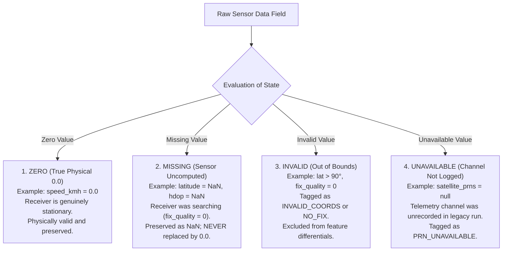

# LOCUS Phase 3 — Final Structured GNSS Observation Dataset

**Document Version**: 1.0  
**Phase**: LOCUS Phase 3 (Structured GNSS Dataset)  
**Dataset Artifact**: [`data/structured/locus_structured_gnss.csv`](file:///c:/Users/New/Downloads/Logs/Logs/Task/locus_project/data/structured/locus_structured_gnss.csv)  
**Total Records**: 10,938  
**Domain**: Synchronized 1Hz GNSS Physical Observations (NOT Machine Learning Features)  

---

## 1. Architectural Purpose

[`locus_structured_gnss.csv`](file:///c:/Users/New/Downloads/Logs/Logs/Task/locus_project/data/structured/locus_structured_gnss.csv) is the canonical, verified observation foundation for the LOCUS GNSS Security Framework. It establishes the single source of ground truth between low-level serial NMEA ingestion and the downstream threat detection engine.

### Strict Architectural Boundaries:
- **Pure Observations**: Contains only direct sensor measurements and synchronized temporal coordinates.
- **Zero Feature Leakage**: Does **not** compute derived security features (e.g., jerk, velocity differentials, or anomaly scores). Those are strictly isolated to Phase 4 ([`locus_security_features.csv`](file:///c:/Users/New/Downloads/Logs/Logs/Task/locus_project/data/features/locus_security_features.csv)).
- **No Machine Learning**: No training, inference, or clustering is executed at this layer.
- **Observation Preservation**: Unlocked, searching, or degraded epochs are retained with explicit quality flags rather than silently discarded.

---

## 2. Complete Column-by-Column Specification

| # | Column Name | Source Sentence | Data Type | Physical Unit | Permissible Range | Missing Value Strategy | Physical Meaning & Security Role |
| :-: | :--- | :---: | :---: | :---: | :---: | :--- | :--- |
| **1** | `epoch_id` | Refactored Pipeline | `int64` | Counter | $[1, \infty)$ | Non-nullable (starts at 1 per session) | Sequential 1-indexed epoch counter within the active continuous session. Guarantees clean within-session sequence indexing. |
| **2** | `session_id` | Refactored Pipeline | `int64` | Identifier | $[1, 15]$ | Non-nullable | Discrete session identifier incremented whenever wall-clock inter-epoch gap $\Delta t > 5.0\text{ s}$. Prevents cross-session differential contamination. |
| **3** | `timestamp_utc` | RMC + Calendar Date | `string` | ISO-8601 UTC | `YYYY-MM-DDTHH:MM:SS.sssZ` | Non-nullable | Synchronized atomic GNSS UTC timestamp. Reconstructed from RMC time-of-day and validated against atomic satellite clocks. Primary time base for physical kinematics. |
| **4** | `timestamp_pc` | Host Serial Ingestion | `string` | ISO-8601 Local | `YYYY-MM-DDTHH:MM:SS.ffffff` | Non-nullable | Operating system reception wall-clock time (+05:30 IST). Preserved for monotonic arrival tracking and serial buffer delay audit. |
| **5** | `latitude` | GGA | `float64` | Degrees North | $[-90.0, 90.0]$ | Preserved as `NaN` during fix search | WGS-84 geodetic latitude. Never fabricated as `0.0` when fix is lost. Bounded by receiver coordinates $\approx 23.104^\circ\text{N}$. |
| **6** | `longitude` | GGA | `float64` | Degrees East | $[-180.0, 180.0]$ | Preserved as `NaN` during fix search | WGS-84 geodetic longitude. Never fabricated as `0.0` when fix is lost. Bounded by receiver coordinates $\approx 72.592^\circ\text{E}$. |
| **7** | `altitude_m` | GGA | `float64` | Meters | $[-500.0, 50000.0]$ | Preserved as `NaN` during fix search | Orthometric height above mean sea level from GGA. Stationary baseline elevation $\approx 66.1\text{ m}$. |
| **8** | `speed_kmh` | RMC | `float64` | km/h | $[0.0, 1000.0]$ | Non-nullable (`0.0` is true physical stationary speed) | Direct Doppler carrier shift ground speed ($v = \text{knots} \times 1.852$). Independent of coordinate displacements. |
| **9** | `heading_deg` | RMC | `float64` | Degrees True | $[0.0, 360.0)$ | Non-nullable | Ground track course relative to true North. |
| **10** | `fix_quality` | GGA | `int64` | Categorical Code | $\{0, 1, 2, 4, 5\}$ | Non-nullable | Fix status: `0` = Searching/Lost, `1` = Autonomous GPS SPS, `2` = Differential GPS / SBAS corrected. |
| **11** | `satellites_used` | GGA | `int64` | Count | $[0, 36]$ | Non-nullable (`0` during cold start) | Satellites actively contributing to the navigation solution. Multi-GNSS baseline: 5 to 27 satellites (mean: 21.2). |
| **12** | `satellites_in_view` | GSV (All Talkers) | `int64` | Count | $[0, 60]$ | Non-nullable (`0` during cold start) | Total visible satellites above the horizon across all constellations (GPS + GLONASS + Galileo + BeiDou). Summed across GSV messages. |
| **13** | `satellite_prns` | GSV / GSA | `string` | Delimited String | e.g. `"GP01;GP03;GL07"` | Null in historical baseline (see Section 4) | Semicolon-delimited list of active satellite PRN identifiers. Required for set-theoretic `sat_churn`. |
| **14** | `hdop` | GSA / GGA | `float64` | Unitless Ratio | $[0.5, 50.0]$ | Preserved as `NaN` during fix search | Horizontal Dilution of Precision. Geometric distribution quality in horizontal plane (mean: 0.95). |
| **15** | `vdop` | GSA | `float64` | Unitless Ratio | $[0.5, 50.0]$ | Preserved as `NaN` during fix search | Vertical Dilution of Precision. Satellite geometry in the vertical plane (mean: 0.93). |
| **16** | `pdop` | GSA | `float64` | Unitless Ratio | $[0.5, 50.0]$ | Preserved as `NaN` during fix search | 3D Position Dilution of Precision: $\sqrt{\text{HDOP}^2 + \text{VDOP}^2}$ (mean: 1.34). |
| **17** | `avg_cno` | GSV | `float64` | dB-Hz | $[0.0, 60.0]$ | Non-nullable (`0.0` when no channels active) | Arithmetic mean carrier-to-noise ratio across all tracked satellite channels (mean: 27.35 dB-Hz). Primary jamming indicator. |
| **18** | `max_cno` | GSV | `float64` | dB-Hz | $[0.0, 60.0]$ | Non-nullable (`0.0` when no channels active) | Peak carrier-to-noise density ratio in the epoch (mean: 40.67 dB-Hz). |
| **19** | `min_cno` | GSV | `float64` | dB-Hz | $[0.0, 60.0]$ | Non-nullable (`0.0` when no channels active) | Weakest tracked satellite signal strength in the epoch (mean: 11.63 dB-Hz). |
| **20** | `data_quality_flag`| Preprocessor | `string` | Pipe-delimited | Tags | Non-nullable | Complete observation health status bitmask/tags (e.g. `"VALID\|PRN_UNAVAILABLE"`). |

---

## 3. The Four-Way Data Value Distinction

To avoid corrupting downstream physics and anomaly detection, LOCUS enforces strict mathematical distinction between four different data states:



1. **Zero (`0.0`)**: A physically valid sensor measurement. For example, `speed_kmh = 0.0` indicates zero velocity while stationary.
2. **Missing (`NaN`)**: A measurement that the GNSS receiver could not compute because it lacked satellite lock (e.g., `latitude`, `longitude`, `altitude_m`, `hdop`, `pdop`, `vdop` during cold-start). **These fields remain `NaN` and are never silently filled with 0.0**, which would otherwise mislocate the antenna at (0°, 0°) in the Gulf of Guinea.
3. **Invalid**: Data that fails physical integrity or boundary checks (e.g. latitude out of range, or uncalibrated epoch). Tagged via `data_quality_flag`.
4. **Unavailable**: Information that the receiver firmware or legacy logger omitted from the transmission (e.g. `satellite_prns` in the baseline dataset). Explicitly tagged with `PRN_UNAVAILABLE`.

---

## 4. Satellite PRN Handling & Churn Strategy

### 4.1 Historical Telemetry Baseline Limitation
In the 10,938 records collected in the initial runs, the legacy logger parsed GSV signal strengths but omitted individual PRN identity fields (`sv_prn_num_*`). Consequently:
- `satellite_prns` is preserved as `null` / empty string.
- Every record is explicitly tagged with `PRN_UNAVAILABLE`.
- In Phase 4, the historical baseline will compute satellite turnover via the empirical **satellite flux proxy**:
  $$\text{sat\_churn}_{\text{proxy}}(t) = \frac{|\Delta S_{\text{used}}| + \text{clip}\left(\frac{|\Delta \text{avg\_cno}|}{3.0}, 0, 2\right)}{\Delta t}$$

### 4.2 Upgraded Forward-Compatible Ingestion
The refactored [`src/parsing/nmea_parser.py`](file:///c:/Users/New/Downloads/Logs/Logs/Task/locus_project/src/parsing/nmea_parser.py) and [`src/parsing/epoch_aggregator.py`](file:///c:/Users/New/Downloads/Logs/Logs/Task/locus_project/src/parsing/epoch_aggregator.py) now parse:
- Individual satellite PRNs from all GSV messages across constellations (`GP01`, `GL65`, `GA05`, `BD03`).
- Active satellite IDs from GSA messages.
- As new collection runs occur, `satellite_prns` will contain the active PRN strings, allowing Phase 4 to compute true set-theoretic Jaccard churn:
  $$\text{sat\_churn}_{\text{set}}(t) = \frac{|\text{PRNs}_t \setminus \text{PRNs}_{t-1}| + |\text{PRNs}_{t-1} \setminus \text{PRNs}_t|}{\Delta t}$$

---

## 5. Quality Rules & Flag Taxonomy

| Quality Flag Tag | Logical Rule / Condition | Count in Dataset | % of Dataset |
| :--- | :--- | :---: | :---: |
| `VALID` | `fix_quality > 0` and $-90 \le \text{lat} \le 90$ and $-180 \le \text{lon} \le 180$ | 9,382 | 85.77% |
| `NO_FIX` | `fix_quality == 0` or coordinates are null | 1,556 | 14.23% |
| `INVALID_COORDS` | Coordinate coordinates outside WGS-84 boundary | 0 | 0.00% |
| `DEGRADED_DOP` | $\text{HDOP} > 3.0$ or $\text{PDOP} > 5.0$ | 0 | 0.00% |
| `LOW_CNO` | $0 < \text{avg\_cno} < 20.0\text{ dB-Hz}$ | 297 | 2.72% |
| `SESSION_START` | First epoch after inter-record gap $\Delta t > 5.0\text{ s}$ | 15 | 0.14% |
| `DUPLICATE_EPOCH` | Identical PC timestamp to preceding record | 0 | 0.00% |
| `PRN_UNAVAILABLE` | `satellite_prns` is null or empty | 10,938 | 100.00% |

### Compound Flag Combinations
- `VALID|PRN_UNAVAILABLE`: **9,253** records (84.60%) — High-integrity locked fixes.
- `NO_FIX|PRN_UNAVAILABLE`: **1,373** records (12.55%) — Cold-start acquisition periods.
- `NO_FIX|LOW_CNO|PRN_UNAVAILABLE`: **168** records (1.54%) — Signal search with low carrier strength.
- `VALID|LOW_CNO|PRN_UNAVAILABLE`: **129** records (1.18%) — Locked fixes with attenuated carrier strength.
- `SESSION_START|NO_FIX|PRN_UNAVAILABLE`: **15** records (0.14%) — Session demarcation initializers.

---

## 6. Session Integrity & Sorting Verification

- **Total Detected Sessions**: **15 discrete continuous sessions**.
- **Within-Session Monotonicity**: Verified across all 15 sessions. Timestamps are strictly ordered ascending ($\Delta t > 0$).
- **Maximum Inter-Session Gaps**:
  - Session 4 $\rightarrow$ 5: **88,706.94 s** (24.64 hours, overnight pause)
  - Session 5 $\rightarrow$ 6: **87,447.20 s** (24.29 hours, overnight pause)
  - Session 1 $\rightarrow$ 2: **36,035.20 s** (10.01 hours, morning pause)
  - Session 11 $\rightarrow$ 12: **29,544.24 s** (8.21 hours, afternoon pause)

---

## 7. Dataset Summary & Acceptance Sign-off

```
================================================================================
               LOCUS PHASE 3 STRUCTURED DATASET VALIDATION REPORT               
================================================================================
File Location                   : data/structured/locus_structured_gnss.csv
File Size                       : 1,816,523 bytes (~1.82 MB)
Total Records                   : 10,938 rows
Total Columns                   : 20 columns
Valid Locked Epochs             : 9,382 rows (85.77%)
Invalid Search Epochs           : 1,556 rows (14.23%)
Identified Sessions             : 15 sessions (isolated with gap > 5.0s)
GNSS UTC Timestamp Range        : 2026-09-24T18:33:48.747484Z to 2026-09-27T17:45:00.000000Z
PC System Timestamp Range       : 2026-09-25T00:03:48.747484 to 2026-09-27T23:15:00.212629
Within-Session Timestamp Order  : 100% Strictly Monotonic Increasing
Missing Value Strategy          : Preserved as NaN; No False Zero-Filling
Machine Learning State          : Not Implemented (Phase 5)
Security Feature Vectors        : Not Implemented (Phase 4)
Validation Status               : PASSED — Ready for Phase 4 Feature Engineering
================================================================================
```

*Compiled and validated autonomously for the LOCUS GNSS Cybersecurity Framework.*
